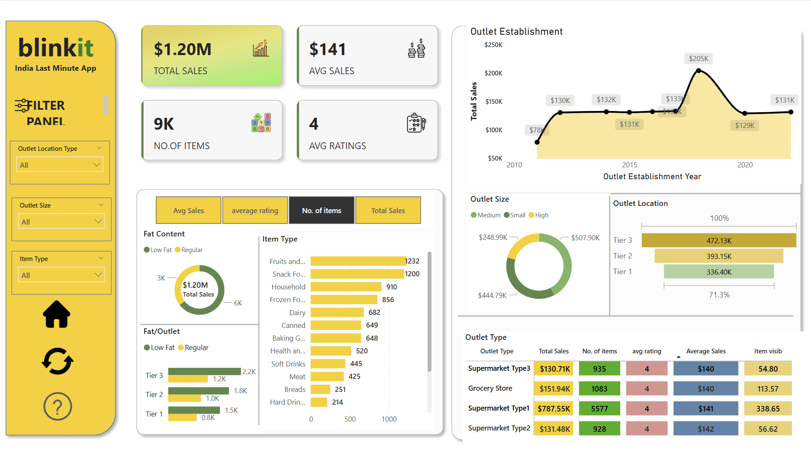

# 🛒 Blinkit Sales Dashboard — Power BI

> An interactive sales analytics dashboard built for **Blinkit** (India's Last Minute App), providing real-time insights into outlet performance, product categories, and sales trends.

---

## 📊 Dashboard Preview

---

## 🔍 Project Overview

This Power BI dashboard analyzes Blinkit's retail sales data across multiple outlet types, locations, and product categories. It enables stakeholders to quickly identify top-performing outlets, track sales trends over time, and understand customer preferences by fat content and item type.

---

## 🚀 Key Metrics

| Metric | Value |
|---|---|
| 💰 Total Sales | $1.20M |
| 📦 Number of Items | 9,000+ |
| ⭐ Average Rating | 4.0 |
| 📈 Average Sales | $141 |

---

## 📌 Key Insights

- **Supermarket Type 1** is the top-performing outlet with **$787.55K** in total sales
- **Fruits & Vegetables** and **Snack Foods** are the most stocked item types with **1,232** and **1,200** items respectively
- **Tier 3** outlets lead in both fat content categories (Low Fat & Regular) with **2.2K** items
- Sales peaked in **2018** at **$205K** and stabilized around **$131K** in recent years
- **Tier 3** outlet locations generate the highest revenue at **$472.13K**
- **Low Fat** products outsell Regular products across all outlet tiers

---

## 🛠️ Tools & Technologies

- **Power BI Desktop** — Dashboard design & data visualization
- **Microsoft Excel** — Data cleaning & preparation
- **DAX** — Calculated measures and KPIs
- **Power Query** — Data transformation

---

## 📂 Dashboard Features

- **Filter Panel** — Dynamic filters for Outlet Location Type, Outlet Size, and Item Type
- **KPI Cards** — Total Sales, Avg Sales, No. of Items, Avg Ratings
- **Fat Content Analysis** — Donut chart comparing Low Fat vs Regular products
- **Item Type Breakdown** — Horizontal bar chart across 12 product categories
- **Outlet Establishment Trend** — Line chart showing sales from 2010–2022
- **Outlet Size & Location** — Donut chart and stacked bar by tier
- **Outlet Type Comparison** — Detailed table with sales, ratings, and visibility

---

## 👩‍💻 Author

**Harsha Gudapati**
- 🔗 [LinkedIn](https://linkedin.com/in/gharshasree)
- 🐙 [GitHub](https://github.com/Harsha999-png)
- 🌐 [Portfolio](https://harsha999-png.github.io/Portfolio)
